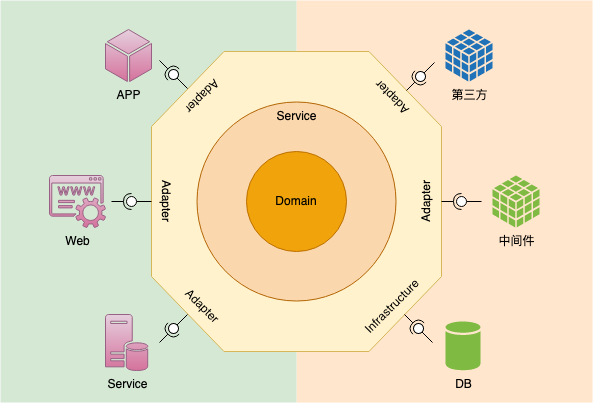

#  Yi

一套易于使用的Java后端代码框架。

[![][GitHub img]][GitHub]
[![][CircleCI img]][CircleCI]
[![][Sonar img]][Sonar]

## 架构

## 技术栈

### 后端技术

- Spring Boot (2.5.5)
- Redission (3.17.4)
- Lombok (1.18.24)
- Hutool (5.7.22)
- MapStruct (1.4.2.Final)

### 前端技术

- [AdminLTE 3](https://github.com/ColorlibHQ/AdminLTE)

[GitHub]:https://github.com/burgeon-0/yi/actions
[GitHub img]:https://github.com/burgeon-0/yi/actions/workflows/build.yml/badge.svg

[CircleCI]:https://dl.circleci.com/status-badge/redirect/gh/burgeon-0/yi/tree/master
[CircleCI img]:https://dl.circleci.com/status-badge/img/gh/burgeon-0/yi/tree/master.svg?style=svg

[Sonar]:https://sonarcloud.io/summary/new_code?id=burgeon-0_yi
[Sonar img]:https://sonarcloud.io/api/project_badges/measure?project=burgeon-0_yi&metric=sqale_index
